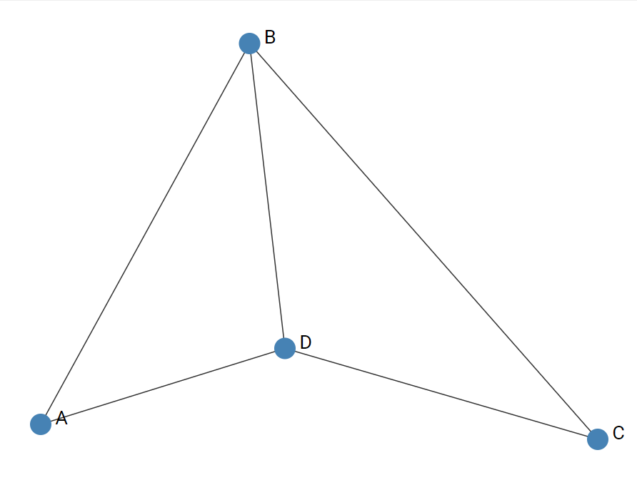

# visx works

<!-- START doctoc generated TOC please keep comment here to allow auto update -->
<!-- DON'T EDIT THIS SECTION, INSTEAD RE-RUN doctoc TO UPDATE -->

- [bar-chart](#bar-chart)
- [network](#network)

<!-- END doctoc generated TOC please keep comment here to allow auto update -->

## bar-chart

- [Demo](https://akihiro-tj.github.io/visx-works/bar-chart/)
- [Code](https://github.com/akihiro-tj/visx-works/tree/master/works/bar-chart)

## network

- [Demo](https://akihiro-tj.github.io/visx-works/network/)
- [Code](https://github.com/akihiro-tj/visx-works/tree/master/works/network)
